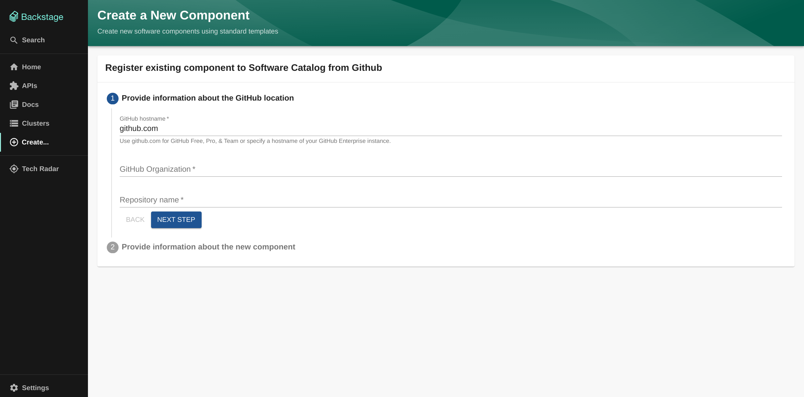
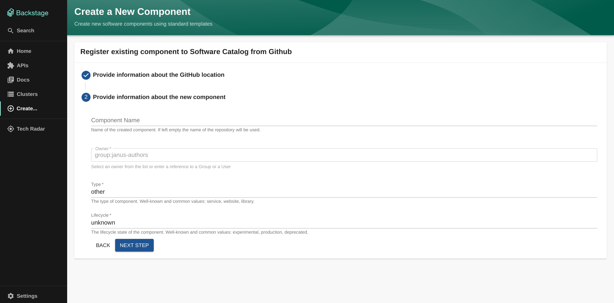
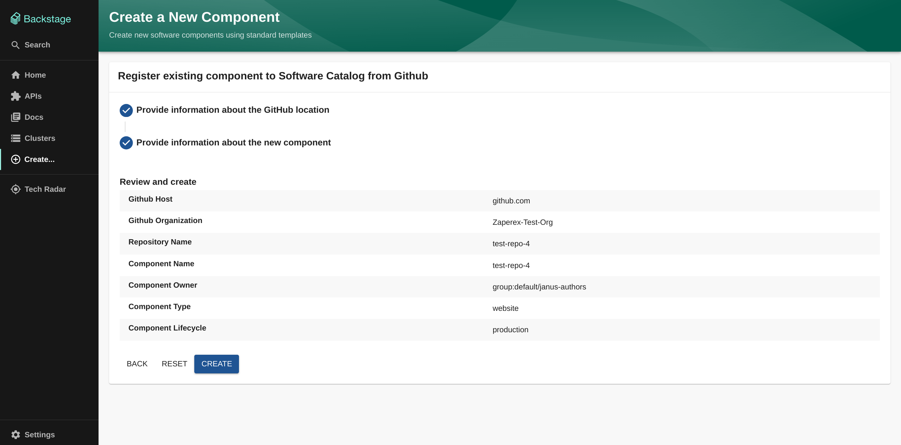
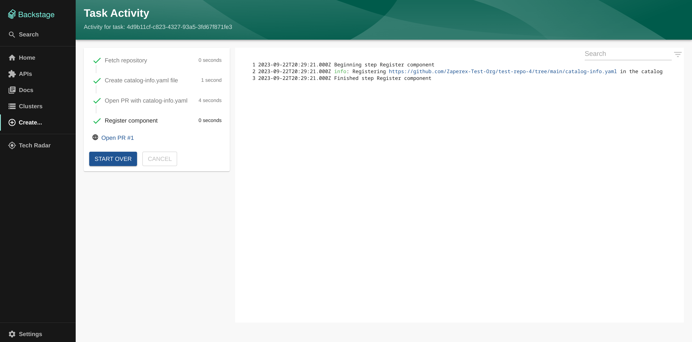

# Register existing component to Service Catalog

This template is intended to be used as a starting point for registering an existing github repository to the Service Catalog. Both github.com and GitHub Enterprise are supported.

## Prerequisites

### Required GitHub permissions

The GitHub application or access token needs to have the following permissions:

- **Repository permissions**
  - **Contents**: **_Read & write_** - To be able to create a new branch and push files new `catalog-info.yaml` file into it.
  - **Pull requests**: **_Read & write_** - To be able to create pull requests with generated `catalog-info.yaml`.
  - **Commit statuses**: **_Read-only_** - To be able to clone private repositories.

## Usage

- `GitHub hostname`: The hostname of your github instance
  - Default value: `github.com`
  - For Github Free, Pro & Team, use `github.com`
  - For Github Enterprise, use the hostname of your instance. e.g. `gitlab.mycompany.com`
  - **NOTE**: this hostname MUST exist in the github integrations in the backstage instance's `app-config.yaml` with the correct access token or github app
- `Github Organization`: The owner of the repository (user or organization)
- `Repository`: The name of the repository where your component is located

- `Component Name` (Optional): The name used to identify the component in the backstage catalog
  - **NOTE**: this name also must adhere to the backstage entity name format [requirements](https://github.com/backstage/backstage/blob/master/docs/architecture-decisions/adr002-default-catalog-file-format.md#name).
  - Additionally, this name should not already be in use in the backstage catalog
  - If left blank, the value of `Gitlab project name` will be used instead
    - If the value of `Gitlab project name` is used, then it must also adhere to these requirements,
  - If these requirements are not met, the component will not be ingested properly.
  - Used to populate the [`metadata.name`](https://backstage.io/docs/features/software-catalog/descriptor-format/#specowner-required) field of the component's `catalog-info.yaml`
- `Owner`: The owner of the component in the backstage catalog

  - Expects a `User` or `Group` entity in the backstage catalog
  - This value is inputted via a dropdown menu, and will only show users and groups that already exist in the backstage catalog
  - This template will not function correctly if no `User` or `Group` entities exist in the backstage catalog
  - Used to populate the [`spec.owner`](https://backstage.io/docs/features/software-catalog/descriptor-format/#specowner-required) field of the component's `catalog-info.yaml`

- `Type`: The type of component in the backstage catalog
  - Default value: `other`
  - Well-known and common values: service, website, library.
  - Used to populate the [`spec.type`](https://backstage.io/docs/features/software-catalog/descriptor-format#spectype-required) field of the component's `catalog-info.yaml`
- `Lifecycle`: The lifecycle stage of the component in the backstage catalog
  - Default value: `unknown`
  - Well-known and common values include: experimental, production, deprecated.
  - Used to populate the [`spec.lifecycle`](https://backstage.io/docs/features/software-catalog/descriptor-format/#speclifecycle-required) field of the component's `catalog-info.yaml`

Once all these values are filled in, you should see a summary screen with all your inputted values.

### Expected Output

Once you press create, you should expect all the steps to be completed successfully and the component registered, but not ingested yet.

To ingest the component, you will need to merge the pull request created by the template.
To navigate to the pull request, click the `Go to PR #{PR_NUMBER}` button to be redirected to the corresponding pull request.
Once the pull request is merged, wait up to 5 minutes for the component to be ingested into the catalog.

Once ingested, navigate to the catalog (filter by `kind=Component`) and you should see your newly registered component.
