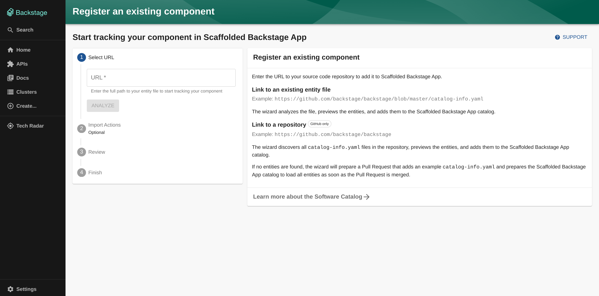
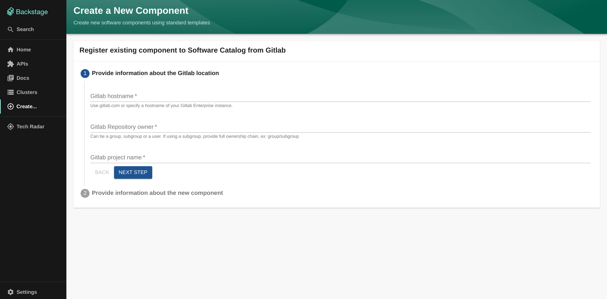
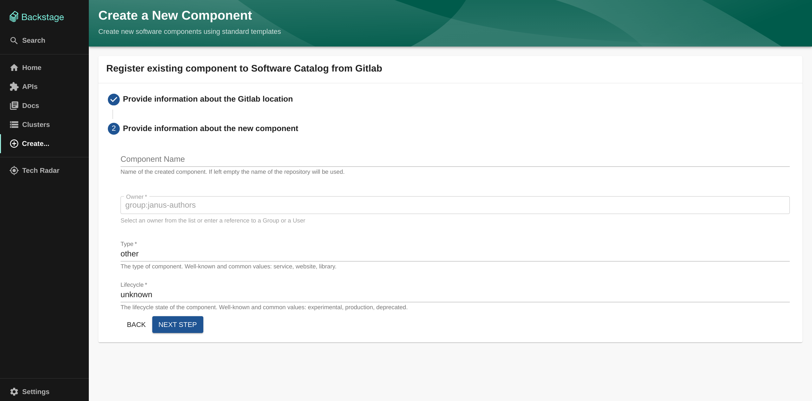
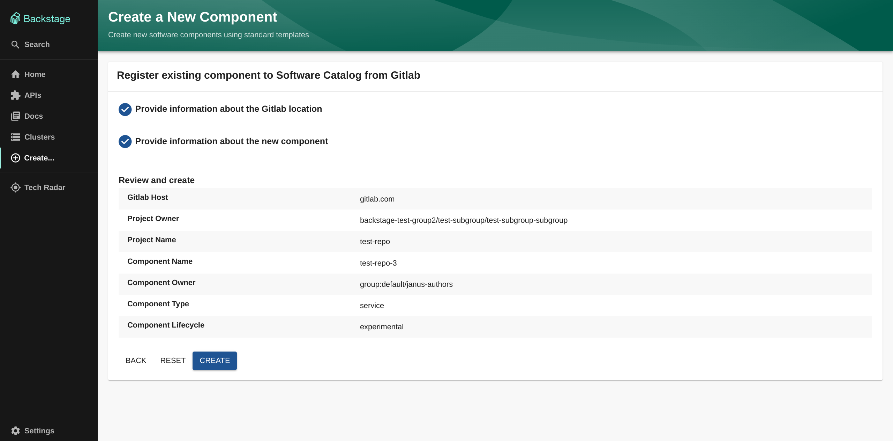

# Register existing component to Service Catalog

This template is intended to be used as a starting point for registering an existing gitlab project to the Service Catalog. Both `gitlab.com` and Gitlab for Enterprise are supported.

## Prerequisites

- Ensure the gitlab host is added to the `app-config.yaml` file in the backstage instance
- If using a private Gitlab instance, make sure the `apiBaseUrl` is set correctly:

  ```yaml
  integrations:
    gitlab:
      - host: gitlab.mycompany.com # this must match the hostname of your gitlab instance
        token: my-gitlab-token
        apiBaseUrl: https://gitlab.mycompany.com/api/v4 # This field is optional if host is `gitlab.com`
  ```

- Make sure that the `add-catalog-info` branch and `catalog-info.yaml` file do not already exist in the project, or else the template will fail
- If a `catalog-info.yaml` file already exists in the repository, please use the built-in `Register Existing Component` button in the `Create...` page instead and provide the url to the `catalog-info.yaml`:
  

### Required Gitlab permissions

- The Gitlab access token needs to have `api` read & write scopes and be added to your gitlab integration

## Usage



- `Gitlab hostname`: The hostname of your gitlab instance
  - Default value: `gitlab.com`
  - For public instances, use `gitlab.com`
  - For Gitlab Enterprise instances, use the hostname of your instance. e.g. `gitlab.mycompany.com`
  - **NOTE**: this hostname MUST exist in the gitlab integrations in the backstage instance's `app-config.yaml` with the correct access token
- `Gitlab project owner`: The user, group or subgroup that the project is owned by
  - Do not provide just the name of the group, you will need to provide the name in the url:
    - Ex: A group may be named `mygroup` but the url could be `https://gitlab.com/mygroup2`, this template will need `mygroup2`
  - For subgroups, use full slug for the subgroup. (`mygroup2/subgroup`, `mygroup2/subgroup/subsubgroup`, etc.)
- `Gitlab project name`: The name of the project where your component is located



- `Component Name` (Optional): The name used to identify the component in the backstage catalog
  - **NOTE**: this name also must adhere to the backstage entity name format [requirements](https://github.com/backstage/backstage/blob/master/docs/architecture-decisions/adr002-default-catalog-file-format.md#name).
  - Additionally, this name should not already be in use in the backstage catalog
  - If left blank, the value of `Gitlab project name` will be used instead
    - If the value of `Gitlab project name` is used, then it must also adhere to these requirements,
  - If these requirements are not met, the component will not be ingested properly.
  - Used to populate the [`metadata.name`](https://backstage.io/docs/features/software-catalog/descriptor-format/#specowner-required) field of the component's `catalog-info.yaml`
- `Owner`: The owner of the component in the backstage catalog

  - Expects a `User` or `Group` entity in the backstage catalog
  - This value is inputted via a dropdown menu, and will only show users and groups that already exist in the backstage catalog
  - This template will not function correctly if no `User` or `Group` entities exist in the backstage catalog
  - Used to populate the [`spec.owner`](https://backstage.io/docs/features/software-catalog/descriptor-format/#specowner-required) field of the component's `catalog-info.yaml`

- `Type`: The type of component in the backstage catalog
  - Default value: `other`
  - Well-known and common values: service, website, library.
  - Used to populate the [`spec.type`](https://backstage.io/docs/features/software-catalog/descriptor-format#spectype-required) field of the component's `catalog-info.yaml`
- `Lifecycle`: The lifecycle stage of the component in the backstage catalog
  - Default value: `unknown`
  - Well-known and common values include: experimental, production, deprecated.
  - Used to populate the [`spec.lifecycle`](https://backstage.io/docs/features/software-catalog/descriptor-format/#speclifecycle-required) field of the component's `catalog-info.yaml`

Once all these values are filled in, you should see a summary screen with all your inputted values.


### Expected Output


Once you press create, you should expect all the steps to be completed successfully and the component registered, but not ingested yet.

To ingest the component, you will need to merge the merge request created by the template.
To navigate to the merge request, click the `Go to Merge Request` button to be redirected to the corresponding merge request.
Feel free to add any additional annotations to the `catalog-info.yaml` file before merging the merge request.
Once the merge request is merged, wait up to 5 minutes for the component to be ingested into the catalog.

Once ingested, navigate to the catalog (filter by `kind=Component`) and you should see your newly registered component.
